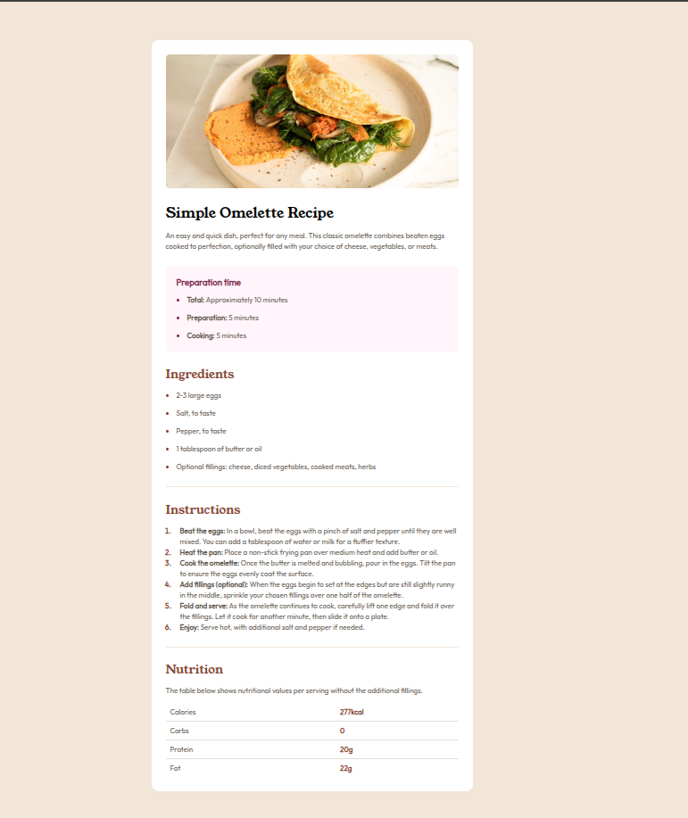

# Frontend Mentor - Recipe page solution

This is a solution to the [Recipe page challenge on Frontend Mentor](https://www.frontendmentor.io/challenges/recipe-page-KiTsR8QQKm). Frontend Mentor challenges help you improve your coding skills by building realistic projects. 

## Table of contents

- [Overview](#overview)
  - [The challenge](#the-challenge)
  - [Screenshot](#screenshot)
  - [Links](#links)
- [My process](#my-process)
  - [Built with](#built-with)
  - [What I learned](#what-i-learned)
  - [Useful resources](#useful-resources)
- [Author](#author)

## Overview

### Screenshot



### Links

- Solution URL: (https://github.com/apsbundela/fem-recipe-page)
- Live Site URL: (https://your-live-site-url.com)

## My process

### Built with

- Semantic HTML5 markup
- CSS custom properties
- Flexbox

### What I learned

#### 🎯`<article>` vs `<section>`

##### Quick Comparison Table

| Element | Meaning | Use case | Rule |
|--------|--------|----------|------|
| `<article>` | Complete, independent content | Recipe, blog, product | Can stand alone |
| `<section>` | Themed part of content | Ingredients, steps | Must have a heading (**IMPORTANT**) |


##### Mental Rules (Easy Revision)

- If it can be shared alone → `<article>`
- If it’s a part of something → `<section>`

---

#### 🎯 How to Make List Dots (Bullets) Colored in CSS

There are **two ways** to change the color of list dots (`ul > li`) in CSS.

##### Method 1: Using `::marker`

The modern and simplest approach.

```css
ul li::marker {
  color: red;
  font-size: 18px; /* optional */
}
```

##### Method 2: Using `Use list-style: none and create your own dot.`

```css
ul {
  list-style: none;
}

ul li {
  position: relative;
  padding-left: 20px;
}

ul li::before {
  content: "•";
  color: green;
  font-size: 20px;
  position: absolute;
  left: 0;
}
```
----
#### 🎯 How to move an ordered list marker slightly inside and control spacing between number and text?
```css

ol {
  padding-left: 1.5rem; /* moves marker inward */
}

ol li {
  padding-left: 0.75rem; /* space between marker & text */
}

ol li::marker {
  font-weight: 700;
  color: var(--Brown-800);
}
```
---

## Key Learnings

- Initially, I focused on creating common CSS classes only for shared properties.
- I realized that reusing the same class for the same element across different sections keeps the CSS simpler and more maintainable.
- I now follow consistent and meaningful class-naming conventions.


### Useful resources

- [Responsive Image Resizing](https://www.youtube.com/watch?v=gn0OaxS1OdY)
- [Responsive Image Resizing More optimized](https://www.youtube.com/watch?v=345V2MU3E_w)
- [KV A practical guide to responsive web design](https://www.youtube.com/watch?v=x4u1yp3Msao)


## Author
- Frontend Mentor - [@apsbundela](https://www.frontendmentor.io/profile/@apsbundela)
